# FitSync Frontend - Cloudflare Pages Deployment

## 🚀 Complete CI/CD Pipeline Setup

### Files Created

```
.github/workflows/
└── deploy.yml              # Complete deployment workflow

wrangler.toml               # Cloudflare Pages configuration
public/_routes.json         # Routing configuration
setup-github-env.md         # Setup instructions
DEPLOYMENT.md              # This file
```

## 📋 Required GitHub Configuration

### 1. Repository Secrets

```bash
CLOUDFLARE_API_KEY=your_cloudflare_global_api_key
CLOUDFLARE_EMAIL=your_cloudflare_account_email
CODECOV_TOKEN=optional_for_coverage_reports
```

### 2. Environment Variables (Development)

```bash
REACT_APP_API_URL=https://dev-api.fitsync.online/api
REACT_APP_WS_URL=wss://dev-api.fitsync.online
DOMAIN=dev.fitsync.online
```

### 3. Environment Variables (Production)

```bash
REACT_APP_API_URL=https://api.fitsync.online/api
REACT_APP_WS_URL=wss://api.fitsync.online
DOMAIN=fitsync.online
```

## 🔄 Workflow Features

### Automatic Triggers

- **Push to `dev`** → Deploy to dev.fitsync.online
- **Push to `main`** → Deploy to fitsync.online  
- **Pull Requests** → Deploy preview + run tests

### Pipeline Steps

1. **Test Suite** (Always runs first)
   - Install dependencies
   - Run unit tests (`npm run test:ci`)
   - Generate coverage (`npm run test:coverage`)
   - Upload to Codecov (optional)

2. **Build & Deploy** (After tests pass)
   - Build with environment-specific variables
   - Deploy to Cloudflare Pages
   - Setup custom domain
   - Comment PR with preview URL

### Test Coverage

- **Unit Tests**: 5 test files found
  - `AuthContext.test.js`
  - `api.test.js` 
  - `authService.test.js`
  - `Input.test.js`
  - `Button.test.js`

## 🌐 Deployment Environments

### Development (dev branch)
- **URL**: https://dev.fitsync.online
- **API**: https://dev-api.fitsync.online/api
- **WebSocket**: wss://dev-api.fitsync.online
- **Auto-deploy**: On push to `dev`

### Production (main branch)  
- **URL**: https://fitsync.online
- **API**: https://api.fitsync.online/api
- **WebSocket**: wss://api.fitsync.online
- **Auto-deploy**: On push to `main`

### Preview (Pull Requests)
- **URL**: https://[commit-hash].fitsync-frontend.pages.dev
- **Temporary**: Deleted when PR closed
- **Testing**: Full functionality with dev API

## 🛠️ Setup Instructions

### 1. Get Cloudflare Credentials

```bash
# Cloudflare Global API Key
# Go to: https://dash.cloudflare.com/profile/api-tokens
# Scroll to "API Keys" section
# Click "View" next to "Global API Key"
# Enter password and copy the key
# Also note your Cloudflare account email
```

### 2. Configure GitHub Repository

```bash
# 1. Add repository secrets
gh secret set CLOUDFLARE_API_KEY --body "your_global_api_key"
gh secret set CLOUDFLARE_EMAIL --body "your_cloudflare_email"

# 2. Create environments
# Go to Settings → Environments → New environment
# Create: development, production

# 3. Add environment variables (via GitHub UI)
```

### 3. Test Deployment

```bash
# Push to dev branch
git checkout dev
git add .
git commit -m "feat: setup cloudflare deployment"
git push origin dev

# Check GitHub Actions tab for workflow status
# Verify deployment at dev.fitsync.online
```

## 🔧 Advanced Configuration

### Custom Domain Setup

The workflow automatically configures custom domains, but you can also set them manually:

```bash
# Install Wrangler CLI
npm install -g wrangler

# Login and setup domains
wrangler login
wrangler pages domain add dev.fitsync.online --project-name=fitsync-frontend
wrangler pages domain add fitsync.online --project-name=fitsync-frontend-prod
```

### Environment Protection

**Development Environment:**
- No approval required
- Deploy from `dev` branch only

**Production Environment:**
- Require reviewers (recommended)
- 5-minute wait timer (optional)
- Deploy from `main` branch only

## 📊 Monitoring & Debugging

### Check Deployment Status

```bash
# GitHub CLI
gh run list --workflow=deploy.yml

# View specific run
gh run view [run-id]

# View logs
gh run view [run-id] --log
```

### Cloudflare Pages Dashboard

- **Deployments**: https://dash.cloudflare.com/pages
- **Analytics**: Built-in traffic and performance metrics
- **Functions**: Can add serverless functions if needed

### Common Issues

1. **Build Failures**: Check environment variables
2. **Domain Issues**: Verify DNS settings in Cloudflare
3. **API Connectivity**: Ensure backend is deployed and accessible
4. **Test Failures**: Fix tests before deployment proceeds

## 🚀 Deployment Flow

```mermaid
graph TD
    A[Push to dev] --> B[Run Tests]
    B --> C{Tests Pass?}
    C -->|Yes| D[Build App]
    C -->|No| E[❌ Deployment Failed]
    D --> F[Deploy to Cloudflare]
    F --> G[Setup Custom Domain]
    G --> H[✅ Live at dev.fitsync.online]
    
    I[Create PR] --> J[Run Tests]
    J --> K{Tests Pass?}
    K -->|Yes| L[Build Preview]
    K -->|No| M[❌ PR Check Failed]
    L --> N[Deploy Preview]
    N --> O[Comment PR with URL]
```



## 📝 Next Steps

1. ✅ Set up GitHub secrets and variables
2. ✅ Create GitHub environments  
3. ✅ Push to `dev` branch to test
4. ✅ Verify deployment works
5. ✅ Create PR to test preview functionality
6. ✅ Set up production branch protection
7. ✅ Configure team access and approvals

Your frontend will now automatically deploy to Cloudflare Pages with every push to `dev`, complete with testing, preview deployments, and custom domain setup! 🎉
